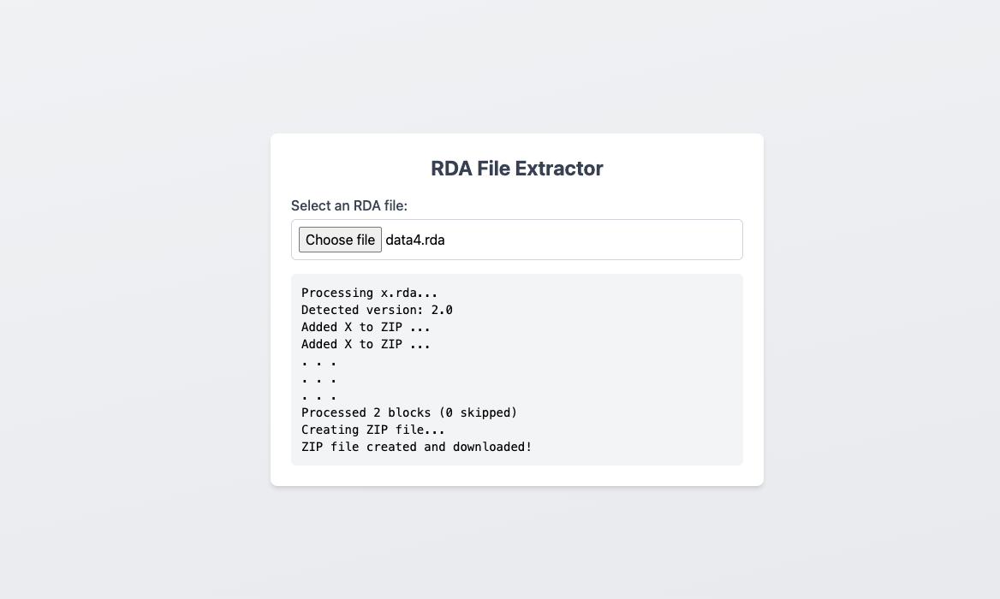

# RDA-WEB-EXPORTER

A **single-page HTML/JavaScript** (partial) port of the [RDAExplorer](https://github.com/lysanntranvouez/RDAExplorer) application, intended to read and export data from RDA files. The original RDAExplorer is a Windows application that can read and save the RDA file format used in Anno 1404, 2070, 2205, and 1800.




## Why I Made This

I only tested this for **Anno 1404 History Edition**, running on **Wine on macOS**.  
This single-page web exporter was primarily created to suit my personal use case on a Mac environment, where running the original Windows-based RDAExplorer was annoying.

- Author: **Ward van der Linden**
- Project Name: **RDA-WEB-EXPORTER**

> **Important**  
> This project is not affiliated with Ubisoft.  
> Anno, Blue Byte, Ubisoft, and the Ubisoft logo are trademarks of Ubisoft Entertainment in the US and/or other countries.

---

## Features

- **Single-HTML File**: Contains all JavaScript/CSS needed to load RDA files in your browser.
- **Read/Export**: Provides a minimal GUI to open and extract contents from an RDA file.
- **Cross-Platform**: Should run on any modern browser with proper File API support. Tested on macOS (via Chrome/Firefox).

---

## Technical Details

### Decryption Process

The RDA format uses a symmetric encryption scheme based on Microsoft's C Runtime Library random number generator - a Linear Congruential Generator (LCG) using the exact constants from msvcrt.dll's rand() implementation (multiplier: 214013, increment: 2531011). Likely chosen for its simplicity and speed rather than security. Here's how the decryption process works:

```mermaid
flowchart TD
  Start([Start Decryption]) --> CheckEmpty{Check Empty Buffer}
  CheckEmpty -->|Empty| ReturnEmpty[Return Empty Buffer]
  CheckEmpty -->|Not Empty| CheckSeed{Check Valid Seed}

  CheckSeed -->|Invalid| ThrowError[Throw Error]
  CheckSeed -->|Valid| Convert["Convert to Int16 Array<br>using DataView"]

  Convert --> InitVars["Initialize:<br>num1 = BigInt&#40;seed&#41;<br>mask = BigInt&#40;0xFFFFFFFF&#41; // 32-bit mask"]
  InitVars --> DecLoop{"For each 16-bit chunk"}

  DecLoop --> CalcKey["Generate Key using MS rand() constants:<br>num1 = &#40;num1 * 214013 + 2531011&#41; &amp; mask<br>num2 = Number&#40;&#40;num1 &gt;&gt; 16&#41; &amp; 0x7FFF&#41; // MS rand() behavior"]
  CalcKey --> XorOp["Decrypt chunk:<br>num3 = chunk ⊕ num2"]
  XorOp --> Store["Store Int16 Result"]
  Store --> DecLoop

  DecLoop -->|Complete| CheckOdd{"Odd Length?"}
  CheckOdd -->|Yes| CopyLast["Copy Last Byte As-Is"]
  CheckOdd -->|No| Final["Return Decrypted Buffer"]
  CopyLast --> Final

  Final --> End([End Decryption])

  classDef process fill:#a8d5ff,stroke:#333,stroke-width:2px
  classDef decision fill:#ffe6a8,stroke:#333,stroke-width:2px
  classDef crypto fill:#ffc9c9,stroke:#333,stroke-width:2px
  classDef error fill:#ffcccb,stroke:#333,stroke-width:2px

  class Convert,InitVars,CalcKey,XorOp,Store,Final process
  class CheckEmpty,CheckSeed,CheckOdd,DecLoop decision
  class ThrowError error
  class ReturnEmpty crypto
   ```

## Usage

1. **Download** the `RDA-WEB-EXPORTER.html` file.
2. **Open** it in a modern browser (Chrome, Firefox, Edge, Safari, etc.).
3. **Load** an RDA file from your local machine using the built-in interface.
4. **Export** or inspect the file’s contents as needed.

> **Disclaimer**: This has only been tested thoroughly on Anno 1404 History Edition files under Wine on macOS (Apple Silicon).  
> Results may vary with other Anno versions or environments. Use at your own risk!

---

## Acknowledgments

- **Deciphering Algorithm**:  
  The core algorithm for reading, decrypting, and processing RDA files is adapted from [RDAExplorer](https://github.com/lysanntranvouez/RDAExplorer).
- **Contributors to RDAExplorer**:
    - [@lysanntranvouez](https://github.com/lysanntranvouez)
    - [@FroggieFrog](https://github.com/FroggieFrog)

---

## License

This project is available under both **MIT** and **BSD 3-Clause** licenses, per the original RDAExplorer. See [LICENSE](LICENSE) for full details.

---

## Disclaimer

This software is **not** affiliated with Ubisoft. It is provided “as is” with **no warranty** of any kind. Please read the full license text for all disclaimers and terms.

**Enjoy exploring your RDA files!**